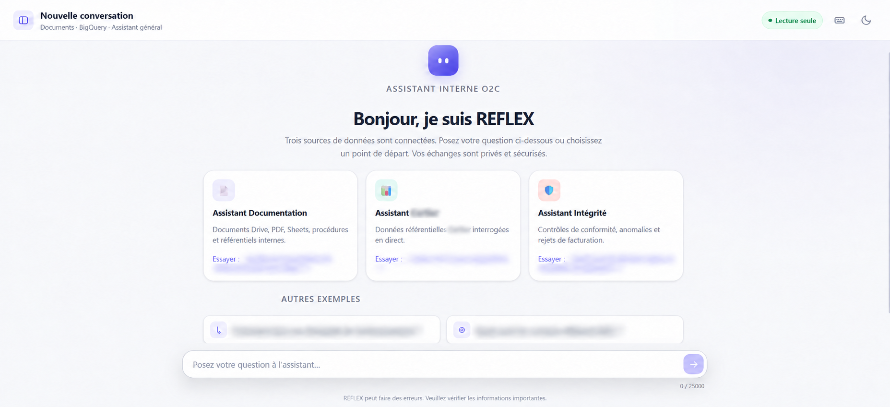
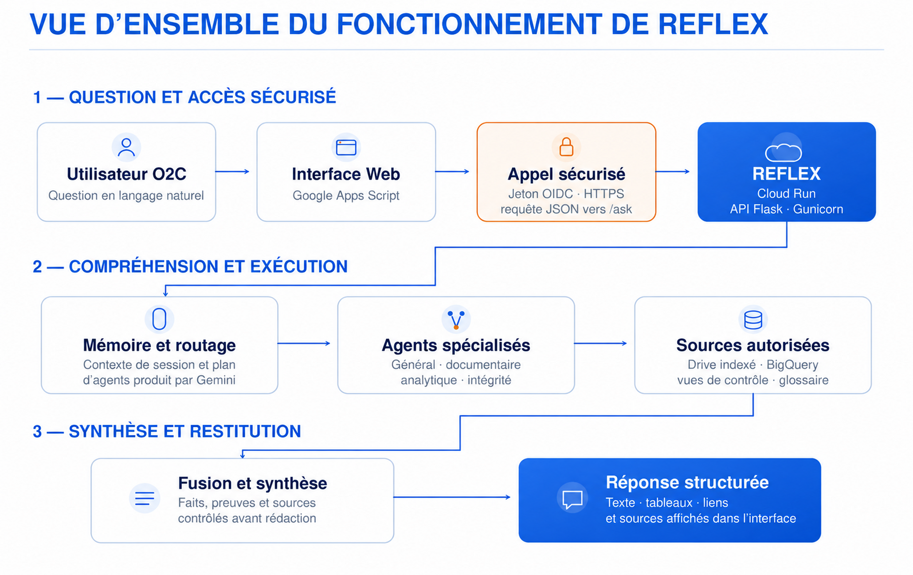
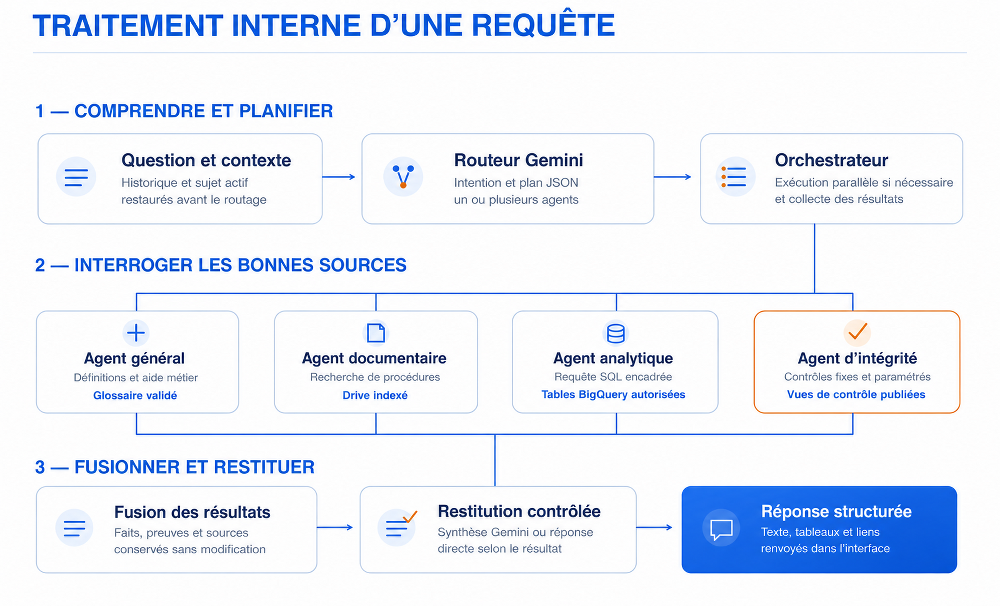
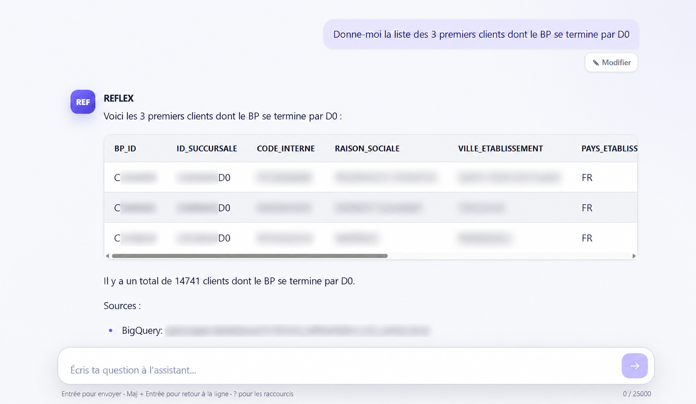
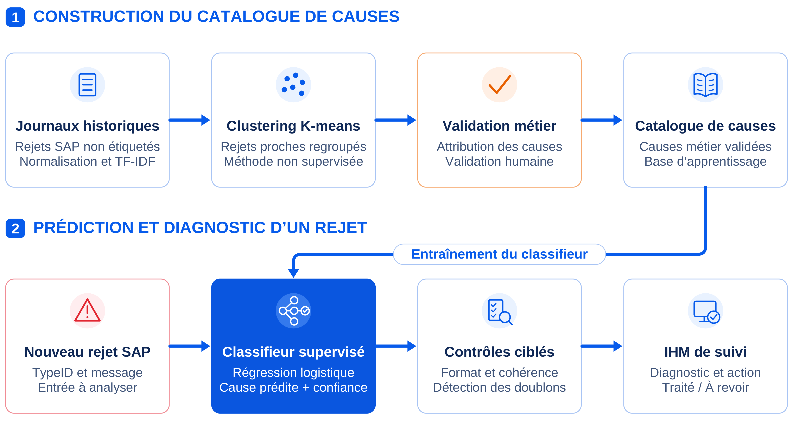
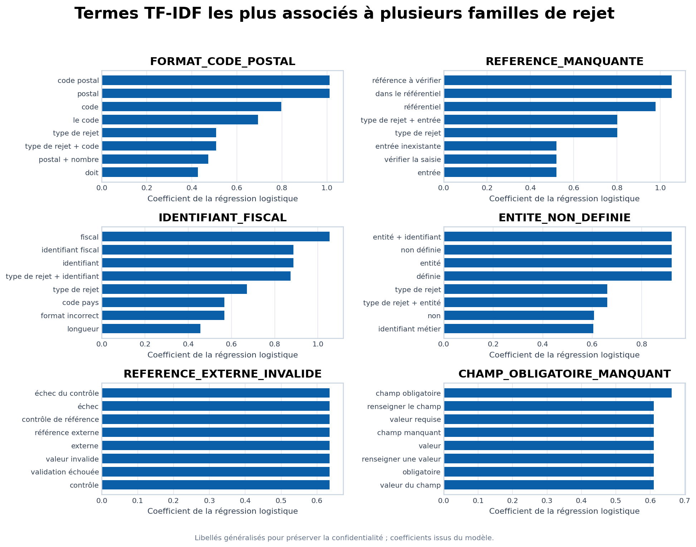
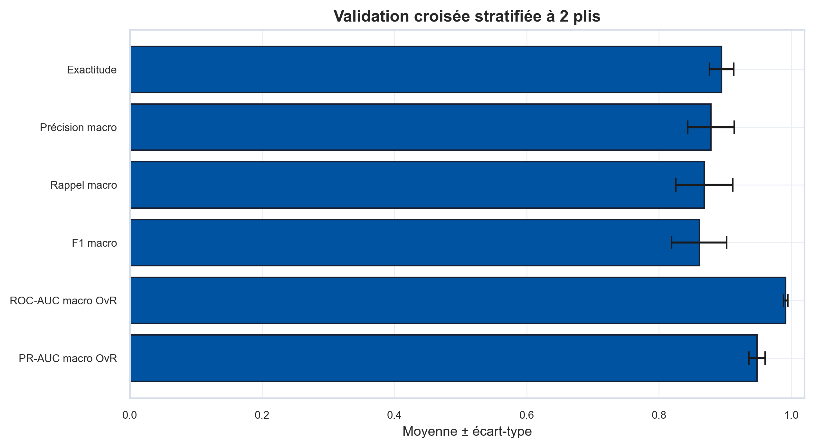
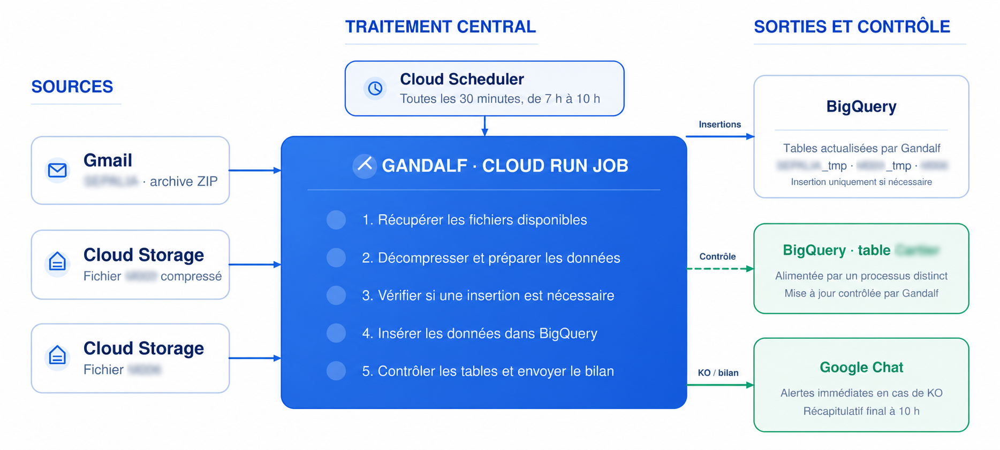
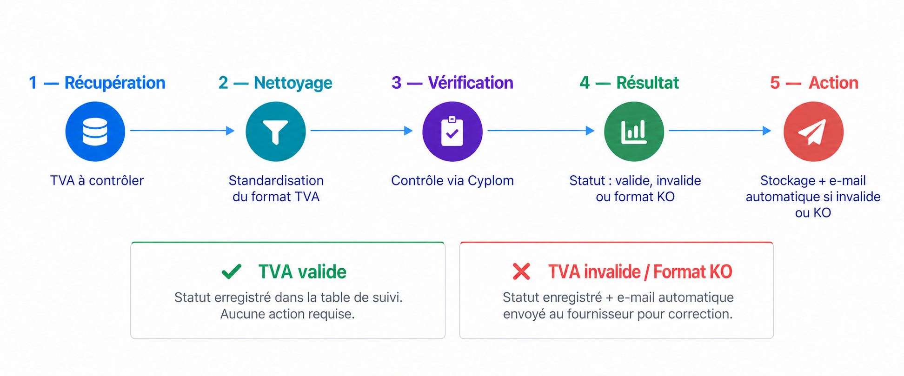

# Ingénierie Data & IA — Processus comptables

  Automatisation des flux · Diagnostic des anomalies · Assistant IA multi-agent

  
  
  
  
  
  
  
  

 

## Contexte et problématique

Dans les processus comptables, la qualité des données de référence constitue un enjeu
essentiel. Une information incorrecte, incomplète ou insuffisamment actualisée peut provoquer
un rejet dans SAP, retarder une opération ou obliger les équipes à rechercher l’origine du
problème dans plusieurs outils. L’augmentation des volumes et du nombre de contrôles rend
également ces vérifications plus difficiles à effectuer manuellement.

La difficulté ne réside donc pas uniquement dans la disponibilité des données, mais dans leur
transformation en informations fiables et directement exploitables. L’automatisation peut
faciliter les contrôles, les recherches et les traitements répétitifs, à condition de rester
traçable, compréhensible et adaptée aux règles métier. Elle doit assister les utilisateurs sans
se substituer à leur validation.

 

> **Comment mobiliser la Data et l’intelligence artificielle pour fiabiliser les processus
> comptables, automatiser les traitements répétitifs et faciliter l’accès à l’information
> métier ?**

 

Cette problématique a constitué le fil conducteur de mon stage de fin d’études au sein de
**Carrefour Administratif France**, dans l’équipe Référentiel du périmètre Order to Cash.
Malgré leur diversité, les projets présentés reposent sur une même démarche : comprendre le
besoin, identifier les sources utiles, développer une solution, puis la tester sur des cas réels
avec les équipes concernées. Mes missions ont progressivement évolué d’automatisations ciblées
vers l’analyse des rejets SAP, le machine learning et l’intelligence artificielle générative.

 

> Ce dépôt présente les problématiques, les architectures, mes contributions et les résultats
> obtenus. Le code source interne, les données métier et les journaux techniques ne sont pas
> publiés.

---

## Vue d’ensemble

| Réalisation | Réponse apportée au besoin métier | Maturité à la fin du stage |
|---|---|---|
| **REFLEX** | Centraliser, en langage naturel, l’accès aux données BigQuery, aux procédures internes et aux diagnostics d’intégrité | Pilote interne déployé et testé |
| **Diagnostic des rejets SAP** | Identifier la cause d’un rejet, contrôler les données concernées et recommander une action corrective | Pilote déployé et testé ponctuellement sur de vrais rejets |
| **Gandalf** | Actualiser chaque matin les tables nécessaires aux équipes et signaler les flux manquants ou en erreur | **Production** |
| **Contrôle TVA — Cyplom** | Contrôler les nouveaux numéros, renouveler les vérifications après six mois et historiser les résultats | **Production** pour le contrôle et le suivi ; notification e-mail non activée |
| **Alerting Trustpair** | Transmettre aux bons interlocuteurs les contrôles défavorables ou non confirmés, sans renvoyer les cas déjà signalés | **Production** |
| **Enrichissement INPI** | Collecter les informations légales nécessaires à un futur enrichissement du référentiel | Extraction validée ; intégration future |

---

## 1. REFLEX — Assistant Data & IA multi-agent

### Besoin

Les utilisateurs devaient consulter séparément des tables BigQuery, des procédures internes,
des documents Drive et des résultats de contrôles. REFLEX réunit ces accès dans une interface
conversationnelle : l’utilisateur pose une question en langage naturel et le système choisit
les traitements à mobiliser.

  

### Capacités principales

| Besoin utilisateur | Traitement réalisé |
|---|---|
| Interroger les données sans écrire de SQL | **Text-to-SQL contrôlé**, validation puis exécution dans BigQuery |
| Retrouver une procédure | Recherche ciblée dans les documents autorisés et réponse sourcée |
| Comprendre un contrôle en échec | Requêtes déterministes et paramétrées, puis explication du constat |
| Combiner données et documentation | Exécution coordonnée de plusieurs agents et fusion des résultats |
| Poursuivre une demande précédente | Mémoire conversationnelle isolée par utilisateur |
| Lever une ambiguïté | Détection des informations manquantes et demande de précision |

### Architecture

  

Un routeur construit un plan d’exécution à partir de la question et du contexte. Un
orchestrateur lance ensuite les agents nécessaires — documentaire, analytique, intégrité ou
général — éventuellement en parallèle. La synthèse finale conserve les faits, les contrôles et
les sources réellement utilisés.

  
<strong>Voir le traitement interne d’une requête</strong>

   
  

    
  

### Exemple : correction contrôlée d’une requête SQL

Pour une demande portant sur un suffixe métier, une première requête appliquait le filtre à la
mauvaise colonne. Une règle déterministe a bloqué cette requête avant son exécution, demandé
une nouvelle génération, puis validé la version corrigée.

  

Ce cas combine compréhension métier, génération SQL, garde-fous déterministes, exécution en
lecture seule et restitution des sources. Les identifiants et le chemin technique visibles dans
la capture ont été masqués ; le résultat présenté provient du test réalisé pendant le stage.

### Sécurité et maturité

- authentification des appels par IAM/OIDC et HTTPS ;
- secrets récupérés depuis Secret Manager ;
- tables et documents limités à un périmètre autorisé ;
- refus des écritures BigQuery et validation des requêtes avant exécution ;
- séparation des historiques entre utilisateurs ;
- journalisation des agents, sources, durées, contrôles et erreurs.

REFLEX a été conteneurisé et déployé sur Cloud Run. Il a été testé par l’équipe O2C et
quelques membres des équipes Data, mais restait un pilote interne et non un produit généralisé
à l’ensemble de l’entreprise.

**Technologies :** Python · Flask · Gunicorn · Gemini · Vertex AI Search · BigQuery ·
Firestore · Cloud Run · Docker · Secret Manager · IAM/OIDC · Cloud Logging

---

## 2. Diagnostic automatique des rejets SAP

### Besoin

Les journaux SAP contenaient des messages techniques difficiles à interpréter. L’objectif ne
se limitait pas à leur attribuer une cause probable : pour chaque rejet, la solution devait
contrôler les données concernées, détecter et localiser l’anomalie, présenter les éléments
vérifiables, puis recommander une action corrective à l’utilisateur.

  

### Données et approche

La préparation a porté sur **24 exports**, **170 915 lignes** et **206 793 messages**, dont
**68 050 doublons** ont été écartés. Après normalisation et regroupement, le corpus comprenait
180 formulations normalisées et 67 identifiants techniques. L’évaluation finale a porté sur
**152 signatures associées à 21 causes validées**.

TF-IDF transforme les messages en vecteurs en donnant davantage de poids aux termes et groupes
de mots discriminants. Ces caractéristiques, complétées par l’identifiant technique `TypeID`,
alimentent une régression logistique chargée d’estimer la cause et un niveau de confiance.

  
   
  Les coefficients proviennent du modèle évalué ; seuls certains libellés métier internes ont été généralisés pour la publication.

### Résultats

| Évaluation | Accuracy | Macro-F1 | Macro précision | Macro rappel | ROC-AUC | PR-AUC |
|---|---:|---:|---:|---:|---:|---:|
| Apprentissage | 0,987 | 0,981 | 0,995 | 0,976 | 1,000 | 1,000 |
| Validation croisée | **0,895 ± 0,019** | **0,861 ± 0,042** | **0,879 ± 0,035** | **0,869 ± 0,043** | **0,991 ± 0,003** | **0,948 ± 0,012** |

  
<strong>Voir la synthèse graphique de la validation croisée</strong>

   
  

    
  

La validation croisée stratifiée à deux plis constitue déjà une évaluation hors apprentissage :
chaque signature est prédite une fois par un modèle qui ne l’a jamais rencontrée. Elle atteint
**89,5 % d’accuracy** et **86,1 % de macro-F1**, ce qui mesure la capacité du classifieur à
généraliser à des formulations inédites du corpus historique. L’étape suivante ne consiste donc
pas à effectuer un premier test sur des données inconnues, mais à confirmer dans le temps la
stabilité du système et la pertinence métier de ses recommandations sur une période indépendante.

Le classifieur est complété par des règles explicables : contrôle de SIRET par l’algorithme de
Luhn, contrôle d’IBAN par modulo 97, cohérences pays/TVA/code postal, détection de doublons
et recherche de références manquantes. La solution rassemble alors la cause estimée, le niveau
de confiance, les contrôles exécutés, les valeurs observées et les sources consultées ; elle
localise le problème et propose une orientation corrective. Elle fournit ainsi un
**diagnostic structuré, vérifiable et exploitable**, et non une simple étiquette prédite.

Pendant le stage, les corrections restaient volontairement désactivées en
raison de la sensibilité des données. L’architecture automatisait déjà les vérifications et,
pour certaines causes techniques, jusqu’à trois tentatives de republication. Une automatisation
plus large des corrections resterait conditionnée à la validation opérationnelle des
recommandations, avec une revue humaine pour les cas **KO**, ambigus ou peu confiants.

**Technologies :** Python · pandas · scikit-learn · TF-IDF · régression logistique ·
clustering K-means · règles métier · BigQuery

---

## 3. Automatisations et applications métier

### 3.1 Gandalf — Alimentation et supervision de BigQuery

Gandalf centralise l’actualisation quotidienne de plusieurs flux opérationnels. Déployé sous la
forme d’un **Cloud Run Job**, il est déclenché toutes les trente minutes pendant la plage
matinale.

  

Le traitement final :

1. récupère les fichiers disponibles dans Gmail et Cloud Storage ;
2. décompresse et prépare les données ;
3. compare la fraîcheur des sources et des tables ;
4. insère dans BigQuery uniquement les versions nécessaires ;
5. publie immédiatement les statuts **KO**, puis un bilan final dans Google Chat.

Une table alimentée par un processus distinct n’est jamais modifiée par Gandalf : seules ses
métadonnées sont contrôlées pour vérifier sa mise à jour quotidienne. Je me suis appuyé sur
des fonctions d’insertion BigQuery déjà disponibles dans l’équipe ; mon apport a porté sur
l’orchestration, le prétraitement, la collecte directe des sources, les contrôles, les alertes et
le déploiement.

**Statut : production.**  
**Technologies :** Python · Gmail API · Cloud Storage · BigQuery · Cloud Run Jobs ·
Cloud Scheduler · Google Chat · Secret Manager

 

### 3.2 Contrôle automatisé des numéros de TVA — Cyplom/VIES

Chaque jour, le traitement sélectionne les numéros jamais contrôlés ou dont la dernière
vérification remonte à au moins six mois. Après normalisation, il interroge **Cyplom**, qui
s’appuie sur **VIES**, puis historise dans BigQuery le statut, la date et les informations
retournées. Un dashboard restitue ensuite ces résultats sans rappeler l’API.

  
   
  La dernière étape représente la cible fonctionnelle : le script d’e-mail avait été préparé, mais n’était ni intégré ni activé à la fin du stage.

Le contrôle, l’historisation et le dashboard fonctionnaient en production. Le dispositif ne
modifie aucune donnée dans le référentiel : l’analyse et la correction éventuelle restent à la
charge des équipes concernées.

**Statut : production pour le contrôle et le suivi ; notification e-mail non activée.**  
**Technologies :** Python · Cyplom API · VIES · BigQuery · traitement par lots · dashboard

 

### 3.3 Alerting Trustpair — Cibler les contrôles à vérifier

Trustpair contrôle la cohérence entre l’identité fiscale d’un tiers et ses coordonnées bancaires.
J’ai repris la requête du dashboard existant pour construire une automatisation Python qui :

- conserve uniquement les résultats **défavorables** ou **non confirmés** ;
- regroupe les cas par périmètre et envoie un e-mail HTML à l’équipe responsable ;
- enregistre la date d’envoi afin d’éviter les doublons ;
- laisse un cas disponible pour une nouvelle tentative si l’envoi échoue.

L’automatisation informe les équipes sans modifier les coordonnées bancaires.

**Statut : production.**  
**Technologies :** Python · BigQuery · Trustpair · Gmail API · HTML

 

### 3.4 Enrichissement des informations légales avec l’INPI

J’ai développé un traitement Python qui interroge l’API du **Registre national des entreprises
de l’INPI** à partir des SIREN exploitables. Il récupère notamment la dénomination, le capital
social et le greffe, puis reconstruit un libellé RCS homogène.

Un fichier de reprise permet de poursuivre l’extraction après une interruption ou une limite
d’API. Le programme gère également le renouvellement du jeton, les SIREN non trouvés et les
erreurs sans arrêter l’ensemble du traitement. Les résultats sont publiés dans Google Sheets.

**Statut : extraction validée pour préparer un enrichissement futur ; aucune mise à jour
directe du référentiel pendant le stage.**  
**Technologies :** Python · API INPI/RNE · BigQuery · Google Sheets · reprise sur incident

---

## Contributions personnelles

- analyse des besoins avec les utilisateurs métier ;
- conception des architectures et développement Python ;
- préparation, validation et historisation des données ;
- entraînement et évaluation du modèle NLP ;
- orchestration de services GCP et intégration d’API ;
- création d’interfaces, dashboards, alertes et restitutions ;
- déploiement, supervision, documentation et transmission à l’équipe.

---

## Stack technique

| Domaine | Technologies et méthodes |
|---|---|
| Langages et données | Python · SQL · pandas · NumPy |
| Machine Learning / NLP | scikit-learn · TF-IDF · régression logistique · K-means · validation croisée |
| IA générative | Gemini · RAG · Text-to-SQL · orchestration multi-agent |
| Backend et interfaces | Flask · Gunicorn · Google Apps Script · APIs REST |
| Données | BigQuery · Cloud Storage · Google Drive · Google Sheets |
| Cloud et déploiement | GCP · Cloud Run · Cloud Run Jobs · Cloud Scheduler · Docker |
| Sécurité et suivi | IAM/OIDC · Secret Manager · Cloud Logging · Google Chat |
| Services intégrés | Vertex AI Search · Gmail API · Cyplom/VIES · Trustpair · INPI/RNE |

---

## Confidentialité

Ce dépôt est une présentation de portfolio et non une publication du système interne :

- aucun code source, jeu de données ou journal d’entreprise n’est fourni ;
- les identifiants et chemins techniques des captures ont été masqués ;
- les noms internes de certains flux et de certaines ressources ont été généralisés ;
- dans le graphique TF-IDF, les coefficients sont issus du modèle évalué, mais certains
  libellés métier ont été remplacés par des formulations génériques ;

---

## Auteur

Réalisations de **El-Fahad COMBO**, dans le cadre du Master 2 Mathématiques appliquées et
Statistique — Data Science de l’**Université de Caen Normandie (2026)**.

📧 [elfahad98@gmail.com](mailto:elfahad98@gmail.com)

